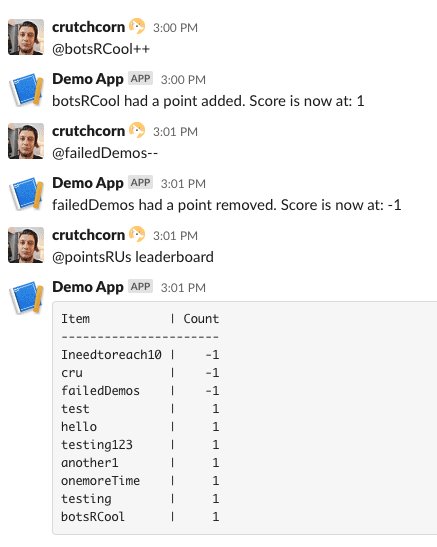

This is the relevant code associated with the Unicorn Utterances blog post about making a Slack Bot using MongoDB and Node:

https://unicorn-utterances.com/posts/making-a-slack-bot-with-node-and-mongo/

You can see a quick demonstration of the project here:

Ultimately, there are multiple revisions of this project in this repo that build on each other until the final version:

1) [The basic event listener](./events.js)
2) [The interactive base code, to be filled in during live coding](./interactive_base.js)
3) [The finalized interactive code](./interactive.js)
4) [The base code to connect to Mongo to be filled in during live coding](./mongo_base.js)
5) [The final MongoDB code for the project](./mongo.js)

## Contact Me!

I wrote this blog post and code in order to give a talk live for [a Slack Meetup](https://slackcommunity.com/events/details/slack-sacramento-presents-building-communities-and-slack-api-integrations/). If you're interested in me giving the same talk (or even a revised one), reach out to 
me [on Twitter](https://twitter.com/crutchcorn). 
